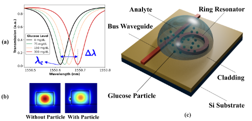

# 🚨 **New Update: Accepted at <i>IEEE Silicon Photonics Conference (SiPhotonics) 2026</i>!** 🚨
# Inverse Design of Microring Resonator-Based Glucose Biosensor Using AI Diffusion Models

---

**For the full paper and technical details, please refer to:**

- **Y. Torabi**, A. Ekhteraei, and B. Baraeinejad, *“Inverse Design of Microring Resonator-Based Glucose Biosensor Using AI Diffusion Models,”* **Optica Open (preprint), 2025.** [https://doi.org/10.1364/opticaopen.30525731](https://doi.org/10.1364/opticaopen.30525731)

## Abstract

Glucose detection is crucial for the diagnosis of diabetes. Microring resonator biosensors detect small refractive index changes. We utilize artificial intelligence (AI) diffusion models for the inverse design of sensor geometries that are consistent with target spectral responses, offering potential for the development of intelligent photonic biosensors.

---

## Keywords

Silicon photonics; microring resonator; glucose biosensor; inverse design; diffusion models; AI for photonics

---

## Citation

If you use this code in your research, please cite:

- **Y. Torabi**, A. Ekhteraei, and B. Baraeinejad, *“Inverse Design of Microring Resonator-Based Glucose Biosensor Using AI Diffusion Models,”* Optica Open (preprint), 2025. [https://doi.org/10.1364/opticaopen.30525731](https://doi.org/10.1364/opticaopen.30525731)

---

## License

© 2025 by Yasaman Torabi. All rights reserved.
